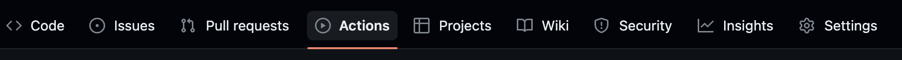
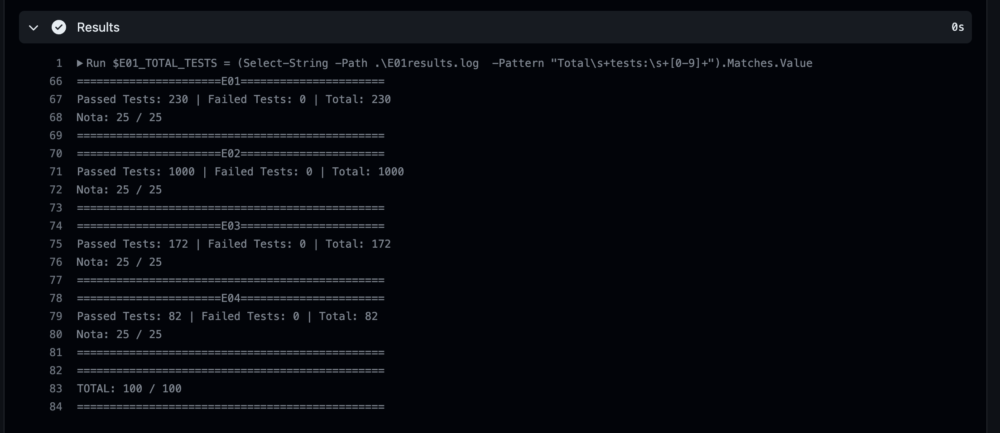
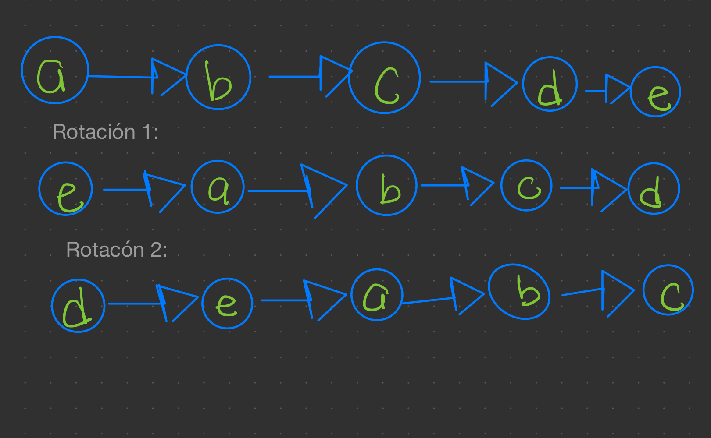
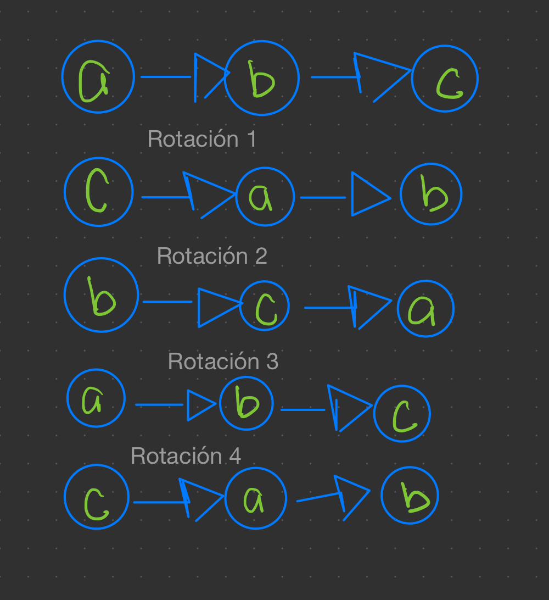

# Hoja de Trabajo 02

- [Hoja de Trabajo 02](#hoja-de-trabajo-02)
  - [Instrucciones](#instrucciones)
  - [Introducción](#introducción)
  - [Ejercicio 1 (25 puntos)](#ejercicio-1-25-puntos)
    - [Ejemplo 1.1](#ejemplo-11)
  - [Ejemplo 1.2](#ejemplo-12)
    - [Restricciones](#restricciones)
  - [Ejercicio 2 (25 puntos)](#ejercicio-2-25-puntos)
    - [Ejemplo 2.1](#ejemplo-21)
    - [Ejemplo 2.2](#ejemplo-22)
    - [Ejemplo 2.3](#ejemplo-23)
    - [Restricciones](#restricciones-1)
  - [Ejercicio 3 (25 puntos)](#ejercicio-3-25-puntos)
    - [Ejemplo 3.1](#ejemplo-31)
    - [Ejemplo 3.2](#ejemplo-32)
    - [Ejemplo 3.3](#ejemplo-33)
    - [Restricciones](#restricciones-2)
  - [Ejercicio 4 (25 puntos)](#ejercicio-4-25-puntos)
    - [Ejemplo 4.1](#ejemplo-41)

## Instrucciones

1. Para iniciar, debe crear un *Fork* del repositorio:


2. Vaya la pestaña de **actions** de su repositorio. Si ve un botón verde, haga clic en él para poder ejecutar las pruebas en el futuro.



3. Clone el nuevo repositorio en su computadora y ábralo en Visual Studio.

4. En el menú de Visual Studio, en la sección de *Build* o *Compilar*, construya la solución.

5. En el menú de Visual Studio, en la sección de Tests, seleccione *Run All Tests*

6. La mayoría de las pruebas deberían fallar.

## Introducción

- Todos los ejercicios deben compilar para poder ser probados. Si por lo menos uno de los ejercicios no compila, la nota será cero.
- Si el código original de un ejercicio no se modifica o la intención de su resolución no es clara, la nota del ejercicicio será de cero puntos, aún si hay pruebas que sí pasen para dicho ejercicio.
- NO agregue nuevos métodos `main()`, de lo contrario ninguna prueba podrá ejecutarse.
- NO cambie la firma de los métodos existentes (no agrege más parámetros ni cambie el nombre), estos son utilizados para probar su código.
- NO haga cambios en las pruebas, esto resulta en un 0 inmediato.
- Puede agregar nuevas clases y/o archivos, como sea necesario.
- Las definiciones de funciones y atributos de las clases se encuentran en archivos `.h`, pero debe implementar las funciones dentro de los `.cpp` equivalentes.
- A continuación encontrará los enunciados de cada uno de los ejercicios. Su nota en cada uno de los ejercicios será la relación entre la cantidad de pruebas que sí pasen sobre la cantidad total de pruebas para ese ejercicio.
- En la pestaña de **Actions** podrá ver como las pruebas se ejecutan con su código implementado (si hace `git push` previamente). En los últimos pasos, puede ver los resultados y su nota:


___

## Ejercicio 1 (25 puntos)

Dado el nodo `head` de una lista simplemente enlazada, rote la lista `k` posiciones hacia la derecha.

### Ejemplo 1.1



    head = [a -> b -> c -> d -> e], k = 2
    resultado = [d -> e -> a -> b -> c]

___

## Ejemplo 1.2



    head = [a -> b -> c], k = 2
    resultado = [ c -> a -> b ]

### Restricciones

- La cantidad de nodos se encuentra entre **0** y **500**
- `'a'` <= `Node.value` <= `'z'`
- 0 <= `k` <= 100

___

## Ejercicio 2 (25 puntos)

Dadas dos listas no vacías, `l1` y `l2`, que representan números enteros no negativos, encuentre la suma de ambos números. Los dígitos de cada número se encuentran *ordenados a la inversa* y cada uno de los nodos contiene únicamente un dígito.

Asuma que ninguno de los dos números se representa con ceros a la izquierda.

### Ejemplo 2.1

    l1 = [2 -> 4 -> 3], l2 = [5 -> 6 -> 4]
    resultado = [7 -> 0 -> 8]

**Explicación:** 342 + 564 = 807
___

### Ejemplo 2.2

    l1 = [0], l2 = [0]
    resultado = [0]

___

### Ejemplo 2.3

    l1 = [9 -> 9 -> 9 -> 9 -> 9 -> 9 -> 9], l2 = [9 -> 9 -> 9 -> 9]
    resultado = [8 -> 9 -> 9 -> 9 -> 0 -> 0 -> 0 -> 1]

**Explicación:** 9999999 + 999 = 10009998

___

### Restricciones

- La canditad de nodos se encuentra entre 1 y 360
- `0` <= `Node.value` <= `9`
- Ningún número se representa con ceros a la izquierda.

___

## Ejercicio 3 (25 puntos)

Dado un string `s` que representa una expresión aritmética, evalúe la expresión y retorne el resultado.

La división es entera. Es decir, `5/3=1`.

La expresión siempre será válida. Tanto el resultado final, como el de cada una de las operaciones serán números entre -2<sup>31</sup> y 2<sup>31</sup>-1.

`s` tendrá únicamente números enteros, operaciones de suma, resta, multiplicación y división y espacios en blanco.

### Ejemplo 3.1

    s = "3+2*2"
    resultado = 7
___

### Ejemplo 3.2

    s = " 3 /2 "
    resultado = 1
___

### Ejemplo 3.3

    s = " 3+5 / 2 "
    resultado = 5
___

### Restricciones

- 1 <= s.length <= 3 * 10<sup>5</sup>
- `s` consiste únicamente de enteros y operadores `['+', '-', '*', '/']`.
- `s` representa una operación aritmética válida.
- Todos los números enteros en la expresión son positivos o cero, en el rango **[0, 2<sup>31</sup>-1]**.
- La respuesta podrá almacenarse en un `int`.

## Ejercicio 4 (25 puntos)

Diseñe una cola en la que se pueda hacer `push`y `pop` al frente, a la mitad y al final.

Implemente la clase `FrontMiddleBackQueue` que se encuentra en `Ejercicio04.h` y `Ejercicio04.cpp`, con las siguientes funcionalidades:

- `FrontMiddleBack()` Constructor que instancia e inicializa la cola.
- `void pushFront(int value)` Agrega value al frente de la cola.
- `void pushMiddle(int value)` Agrega value a la mitad de la cola.
- `void pushBack(int value)` Agrega value al final de la cola.
- `int popFront()` Elimina el elemento al frente de la cola y lo retorna. Si la cola está vacía, retorna -1.
- `int popMiddle()` Elimina el elemento a la mitad de la cola y lo retorna. Si la cola está vacía, retorna -1.
- `int popBack()` Elimina el elemento al final de la cola y lo retorna. Si la cola está vacía, retorna -1.

Cuando existan dos mitades para escoger, `pushMiddle` o `popMiddle` se ejecuta sobre la posición que esté más cercana al frente de la cola.

- Insertando `6` a la mitad de `[1, 2, 3, 4, 5]` resulta en `[1, 2, *6*, 3, 4, 5]`.
- Sacando de la mitad de `[1, 2, 3, 4, 5, 6]` retorna `3` y resulta en `[1, 2, 3, 4, 5, 6]`.

### Ejemplo 4.1

```C++
    FrontMiddleBackQueue* q = new FrontMiddleBackQueue();
    q->pushFront(1);   // [1]
    q->pushBack(2);    // [1, 2]
    q->pushMiddle(3);  // [1, 3, 2]
    q->pushMiddle(4);  // [1, 4, 3, 2]
    q->popFront();     // return 1 -> [4, 3, 2]
    q->popMiddle();    // return 3 -> [4, 2]
    q->popMiddle();    // return 4 -> [2]
    q->popBack();      // return 2 -> []
    q->popFront();     // return -1 -> [] (La cola ha quedado vacía)
```

___
